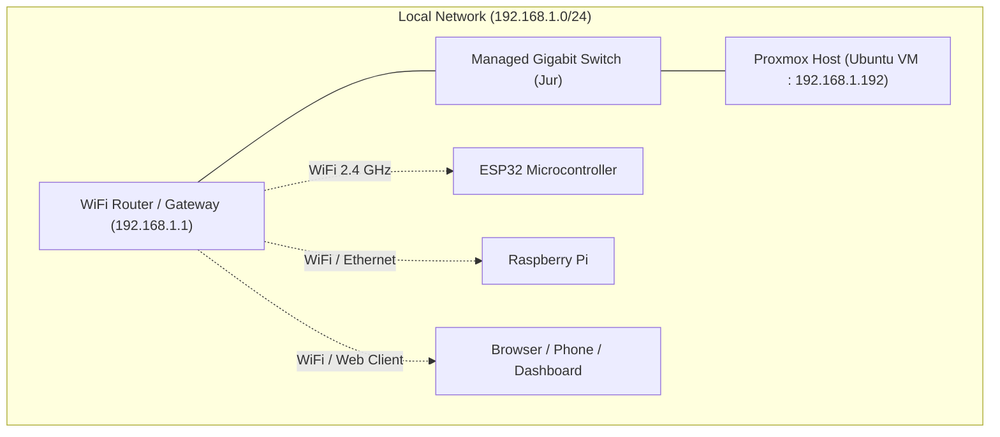
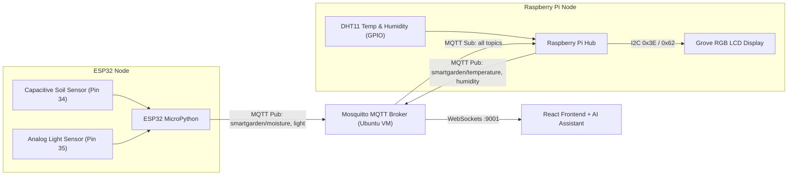

# 🌿 Smart Garden – Project Documentation & Architecture Report

> **Project developed for the Euregio Hackathon**  
> An end-to-end distributed IoT plant monitoring ecosystem featuring real-time telemetry, edge display nodes, centralized broker services on Proxmox, and an AI-powered smart dashboard.

---

## 📑 Table of Contents
1. [Executive Summary](#1-executive-summary)
2. [Network & Infrastructure Design](#2-network--infrastructure-design)
   - [Initial Plan vs. Network Challenges](#initial-plan-vs-network-challenges)
   - [Final Implemented Topology](#final-implemented-topology)
3. [Server & Backend Architecture (Proxmox + Ubuntu)](#3-server--backend-architecture-proxmox--ubuntu)
4. [Hardware & Edge Nodes](#4-hardware--edge-nodes)
   - [ESP32 Sensor Node](#esp32-sensor-node)
   - [Raspberry Pi Node & Hardware Display Hub](#raspberry-pi-node--hardware-display-hub)
5. [Sensor Breakdown](#5-sensor-breakdown)
6. [Interactive Web Frontend & AI Plant Assistant](#6-interactive-web-frontend--ai-plant-assistant)
7. [Helpful Tricks & Mobile Fullscreen Mode](#7-helpful-tricks--mobile-fullscreen-mode)

---

## 1. Executive Summary

The **Smart Garden** is a multi-tier IoT system designed to automate plant care through precision environmental sensing, dynamic edge feedback, and AI-driven diagnosis. 

- **Edge Tier:** Dual microcontroller/SBC setup (ESP32 and Raspberry Pi) monitoring environmental and soil parameters.
- **Transport Tier:** MQTT messaging protocol over TCP (port `1883`) for embedded devices and WebSockets (port `9001`) for browsers.
- **Server Tier:** Ubuntu Server running in a Proxmox virtualized environment hosting the message broker and dashboard backend.
- **Application Tier:** Modern Web Dashboard with real-time analytics, notifications, and an integrated **AI Plant Care Assistant**.

---

## 2. Network & Infrastructure Design

### Initial Plan vs. Network Challenges
The physical networking and hardware switching were spearheaded by **Jur**. 

* **The Original Objective:** Build a secured, segmented enterprise network featuring two distinct Virtual Local Area Networks (VLANs):
  1. **IoT VLAN:** Dedicated strictly for low-power edge nodes (ESP32 and Raspberry Pi).
  2. **Management & Client VLAN:** Reserved for server administration, laptops, and client web dashboards.
* **The Challenge:** The available WiFi access router did not support 802.1Q VLAN trunking and multi-SSID tagging. Consequently, devices connected to the wireless access point were isolated or could not bridge inter-VLAN traffic across the router's wireless interface to communicate with the central server.
* **The Solution (Pivoted Architecture):** To ensure guaranteed real-time communication during the hackathon, the network was consolidated into a unified local subnet (`192.168.1.0/24`). Both wired server hardware and wireless edge nodes operate on this shared subnet with static DHCP assignments, eliminating inter-VLAN routing bottlenecks while maintaining full device reachability.



---

## 3. Server & Backend Architecture (Proxmox + Ubuntu)

A dedicated **Proxmox Virtual Environment (PVE)** server provides high availability and compute virtualization for the project:
* **Host Machine:** Proxmox hypervisor on dedicated physical hardware.
* **Guest Server:** An **Ubuntu Server** virtual machine acting as the primary backend hub.
* **Key Services Hosted:**
  - **Eclipse Mosquitto Broker:** 
    - Port `1883` (Standard TCP) for the ESP32 and Raspberry Pi edge clients.
    - Port `9001` (WebSockets) allowing web browsers to directly stream telemetry without intermediate polling.
    - Configured with `allow_anonymous true` for seamless hackathon plug-and-play operation.
  - **Frontend & Web Server:** Serves the responsive React single-page application and backend API services.

---

## 4. Hardware & Edge Nodes



### ESP32 Sensor Node
* **Firmware:** MicroPython with non-blocking async loops and network resilience.
* **Responsibilities:**
  - Samples analog readings across two separate ADC channels.
  - Calibrates raw ADC integers against known dry/wet thresholds and reference voltages.
  - Publishes calibrated payloads (`smartgarden/moisture` and `smartgarden/light`) every 5 seconds.

### Raspberry Pi Node & Hardware Display Hub
* **Runtime:** Python 3 with CircuitPython / Blinka hardware interfacing.
* **Responsibilities:**
  - Measures air temperature and relative humidity via the DHT11 sensor.
  - Publishes atmospheric metrics to `smartgarden/temperature` and `smartgarden/humidity`.
  - **Edge Display Station:** Incorporates a **Grove RGB LCD Display (JHD1313M3)** connected via hardware I2C (`0x3E` LCD controller, `0x62` RGB backlight driver).
  - Subscribes to the ESP32 sensor topics over MQTT and aggregates all 4 live parameters on screen simultaneously:
    ```text
    +----------------+
    |T:22.4C  H:61%  |
    |Soil:78% L:42%  |
    +----------------+
    ```
  - **Dynamic Mood Backlight:** 
    - 🔴 **Red Alert:** Soil moisture drops below 25% (urgent watering needed).
    - 🔵 **Blue Indicator:** High air humidity (> 70%).
    - 🟢 **Vibrant Green:** Healthy balanced plant state.

---

## 5. Sensor Breakdown

The system deploys **3 dedicated hardware sensor modules** measuring **4 distinct physical metrics**:

| Sensor Module | Host Device | Interfacing | Measured Metric | Operational Range |
| :--- | :--- | :--- | :--- | :--- |
| **DHT11 Sensor** | Raspberry Pi | Digital Single-Wire (GPIO) | **Air Temperature** & **Relative Humidity** | 0–50 °C (±2 °C) / 20–90 % RH (±5 %) |
| **Analog Light Sensor / LDR** | ESP32 | Analog ADC1 (Pin 35) | **Ambient Light Intensity** | 0 % (Dark) to 100 % (Full Sunlight) |
| **Capacitive Soil Moisture** | ESP32 | Analog ADC1 (Pin 34) | **Volumetric Soil Moisture** | 0 % (Dry Air) to 100 % (Submerged in Water) |

> **Advantage of Capacitive Soil Sensing:** Unlike resistive probes that quickly corrode due to electrolysis, capacitive sensing measures soil permittivity with no exposed copper, guaranteeing longevity and accurate readings.

---

## 6. Interactive Web Frontend & AI Plant Assistant

The user-facing dashboard provides comprehensive monitoring and plant diagnostics:
* **Live Telemetry & Real-Time Charts:** High-frequency updates delivered directly via MQTT over WebSockets.
* **History & Data Retention:** Local storage caching and trend visualization to track diurnal moisture and light cycles.
* **Integrated AI Plant Assistant:**
  - Analyzes live sensor values in real-time against individual botanical plant profiles.
  - Answers user queries regarding watering schedules, optimal lux levels, and soil health.
  - Diagnoses plant distress (e.g., overwatering vs. root rot, sun scorching, sudden humidity drops).

---

## 7. Helpful Tricks & Mobile Fullscreen Mode

For kiosk presentations, tablet wall-mounts, or mobile phone monitoring:

### Fullscreen Mode on Android Chrome
To run the dashboard in immersive borderless full-screen without address bar clutter, open the dashboard in Chrome on Android and use the following bookmarklet or console snippet:

```javascript
javascript:document.documentElement.requestFullscreen();
```
*(Bookmark this snippet as a browser bookmark or execute it directly from the Chrome address bar).*
