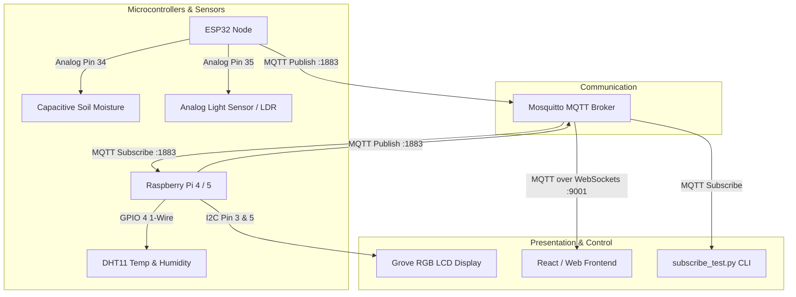

# 🌿 Smart Garden – IoT Monitoring System

A distributed IoT monitoring system for plants and gardens developed for the **Euregio Hackathon**. 

The system collects sensor data across multiple microcontrollers and single-board computers, coordinates them in real time via **MQTT**, displays live status metrics on a **Grove RGB LCD**, and exposes endpoints for Web Frontends and Dashboards via **WebSockets**.

---

## 📐 System Architecture



---

## 📁 Repository Structure

```text
Euregio-Hackaton-Smart-Garden/
├── config.json               # Central configuration (Single Source of Truth)
├── mosquitto.conf            # Mosquitto broker config (TCP 1883 + WebSockets 9001)
├── subscribe_test.py         # Terminal live monitor for all MQTT topics
├── README.md                 # Project documentation
├── TODO.md                   # Task tracking
│
├── esp32_soil/               # ESP32 MicroPython Firmware
│   ├── main.py               # Reads soil & light sensors, publishes to MQTT
│   └── config.json           # Local copy for MicroPico deployment
│
└── rpi/                      # Raspberry Pi Hub
    ├── smart_garden_mqtt.py  # Reads DHT11, subscribes to ESP32, controls LCD
    ├── test_lcd.py           # Standalone hardware test for Grove RGB LCD
    └── tests/
        ├── test_temperature.py   # Test script for DHT11
        └── test_light_sensor.py  # Test script for digital light sensor
```

---

## ⚙️ Configuration (`config.json`)

All devices load their network and topic settings from `config.json`. If you change the broker IP or WiFi credentials, update it here:

```json
{
  "wifi": {
    "ssid": "ASUS_group4",
    "password": "Group4!!"
  },
  "mqtt": {
    "host": "192.168.1.207",
    "port": 1883,
    "ws_port": 9001,
    "username": null,
    "password": null
  },
  "topics": {
    "prefix": "smartgarden",
    "moisture": "smartgarden/moisture",
    "light": "smartgarden/light",
    "temperature": "smartgarden/temperature",
    "humidity": "smartgarden/humidity"
  },
  "esp32": {
    "client_id": "esp32-garden-sensors",
    "soil_pin": 34,
    "light_pin": 35,
    "dry_value": 52700,
    "wet_value": 22000,
    "v_ref": 3.3,
    "interval_s": 5
  },
  "rpi": {
    "client_id": "rpi-smart-garden",
    "dht_pin": 4,
    "interval_s": 10
  }
}
```

---

## 🔌 Hardware Wiring

### 1. ESP32 Node

> **⚠️ Critical ESP32 Hardware Rule**: Both analog sensors use **ADC1 pins** (GPIO 34 and GPIO 35). ADC2 pins (like GPIO 13) cannot be used on ESP32 while WiFi is active.

| Sensor | Sensor Pin | ESP32 Pin | Description |
|---|---|---|---|
| **Capacitive Soil Moisture v1.2** | VCC | **3.3V** | Operating Voltage (Do not use 5V!) |
| | GND | **GND** | Ground |
| | AOUT | **GPIO 34** | ADC1_CH6 (Analog Input) |
| **Analog Light Sensor (LDR / LM393)** | VCC | **3.3V** | Power |
| | GND | **GND** | Ground |
| | AO | **GPIO 35** | ADC1_CH7 (Analog Input) |
| | DO | *Not connected* | Digital pin not used |

---

### 2. Raspberry Pi Hub

| Component | Pin Name | RPi Physical Pin | BCM GPIO | Notes |
|---|---|---|---|---|
| **DHT11 Temp & Humidity** | VCC | **Pin 1** | 3.3V | Power |
| | DATA | **Pin 7** | **GPIO 4** | 1-Wire Data line |
| | GND | **Pin 9** | GND | Ground |
| **Grove RGB LCD (JHD1313M3)** | VCC (Red) | **Pin 2** | 5V | Contrast requires 5V |
| | GND (Black) | **Pin 6** | GND | Ground |
| | SDA (White) | **Pin 3** | **GPIO 2 (SDA)** | Hardware I2C Data (1.8 kΩ Pull-up) |
| | SCL (Yellow) | **Pin 5** | **GPIO 3 (SCL)** | Hardware I2C Clock (1.8 kΩ Pull-up) |

---

## 📡 MQTT Topics & Payloads

| Topic | Publisher | Format | Example Payload |
|---|---|---|---|
| `smartgarden/moisture` | ESP32 | JSON | `{"raw": 42100, "voltage": 2.12, "moisture": 34.5}` |
| `smartgarden/light` | ESP32 | JSON | `{"raw": 18200, "voltage": 0.92, "percent": 72.2}` |
| `smartgarden/temperature` | Raspberry Pi | String / Float | `22.5` |
| `smartgarden/humidity` | Raspberry Pi | String / Float | `48.0` |

---

## 🚀 Getting Started

### 1. Start the MQTT Broker (Server / Laptop)

Using the provided `mosquitto.conf`:

```bash
# On CachyOS / Arch:
mosquitto -c mosquitto.conf -v

# On Ubuntu Server:
sudo cp mosquitto.conf /etc/mosquitto/conf.d/smartgarden.conf
sudo systemctl restart mosquitto
```

The broker exposes:
* **Port 1883**: Standard TCP for ESP32, Raspberry Pi, and Python clients.
* **Port 9001**: WebSockets for Web Frontends and React applications.

---

### 2. Flash & Run ESP32 Firmware

1. Open the project in VS Code with the **MicroPico** extension.
2. Ensure `esp32_soil/main.py` and `esp32_soil/config.json` are on the board.
3. Run or upload `esp32_soil/main.py`.
4. The ESP32 will connect to WiFi and immediately stream readings to `smartgarden/moisture` and `smartgarden/light`.

---

### 3. Run Raspberry Pi Service

On the Raspberry Pi:

```bash
# 1. Install dependencies
sudo apt update && sudo apt install -y python3-pip python3-smbus i2c-tools
pip install paho-mqtt adafruit-circuitpython-dht adafruit-blinka

# 2. Enable I2C in raspi-config
sudo raspi-config # -> Interface Options -> I2C -> Enable

# 3. Start the service
python3 rpi/smart_garden_mqtt.py
```

The LCD will initialize and display:
```text
┌────────────────┐
│T:22.5C  H:48%  │  <-- Pi: Temperature & Air Humidity
│Soil:35% L:72%  │  <-- ESP32: Soil Moisture & Light
└────────────────┘
```

#### Intelligent RGB Backlight Indicator:
* 🔴 **Red**: Soil moisture `< 25%` (Plant urgently needs water!)
* 🔵 **Blue**: Humidity `> 70%` (High moisture environment)
* 🟢 **Green**: Optimal garden condition

---

### 4. Monitor Live Data via CLI

Run the test subscriber from any computer in the network:

```bash
python3 subscribe_test.py
```

Output:
```text
======================================================================
Connected to MQTT broker at 192.168.1.207:1883
Subscribed to topic: 'smartgarden/#'
======================================================================
TIME       | TOPIC                  | READINGS
----------------------------------------------------------------------
00:26:05   | smartgarden/moisture   | Moisture: 34.5%  |  Voltage: 2.12V  |  Raw: 42100
00:26:05   | smartgarden/light      | Light: 72.2%     |  Voltage: 0.92V  |  Raw: 18200
00:26:10   | smartgarden/temperature| 22.5
00:26:10   | smartgarden/humidity   | 48.0
```

---

### 5. Web Frontend / React Integration

Connect directly to Mosquitto via WebSockets on port **9001**:

```javascript
import mqtt from 'mqtt';

const client = mqtt.connect('ws://192.168.1.207:9001');

client.on('connect', () => {
  client.subscribe('smartgarden/#');
});

client.on('message', (topic, message) => {
  const payload = message.toString();
  if (topic === 'smartgarden/moisture') {
    const data = JSON.parse(payload);
    console.log('Soil moisture:', data.moisture + '%');
  }
});
```

---

## 🏆 Hackathon Notes
* **Network Isolation**: Always verify all devices are connected to the same subnet or have valid gateway routes to the broker.
* **Analog Calibration**: Soil calibration can be fine-tuned in `config.json` via `dry_value` (reading in air) and `wet_value` (reading submerged in water).